# SocialVibe API

Welcome to the SocialVibe API repository! This backend application serves as the core engine for the SocialVibe platform, providing essential functionalities for managing users, posts, search capabilities, and more.

You can visit the live site here: [SocialVibe-Api](https://socialvibe-api-32609e33d535.herokuapp.com/)

## Project Structure

The SocialVibe API backend repository is structured as follows:

- **`backend/`**: Main Django project directory.
  - **`backend/`**: Project-level settings and configuration directory.
    - Contains settings.py, urls.py, wsgi.py, asgi.py, and other project-specific configurations.
  - **`__pycache__/`**: Cache directory for Python bytecode.
  - **`account/`**: Django app for user account management.
    - Contains user models, views, serializers, and tests related to user accounts.
  - **`post/`**: Django app for managing posts.
    - Includes post models, views, serializers, and tests.
  - **`search/`**: Django app handling search functionality.
    - Contains search views, serializers, and tests.
  - **`media/`**: Directory for storing media files uploaded by users (configured in Django settings).
  - **`staticfiles/`**: Directory for static files (e.g., CSS, JavaScript) collected during deployment.
- **`.gitignore`**: File specifying which files and directories Git should ignore.
- **`Procfile`**: Configuration file for specifying process types in Heroku deployment.
- **`manage.py`**: Django's command-line utility for administrative tasks.
- **`requirements.txt`**: List of Python packages required to run the SocialVibe API backend.
- **`README.md`**: Markdown file providing an overview, setup instructions, and project details.

### Project-Level `backend/` Directory

#### `backend/`

This directory contains the project-level settings and configurations for the SocialVibe API backend.

- **`settings.py`**: Django settings file defining project settings, database configurations, middleware, etc.
- **`urls.py`**: URL configuration file defining API endpoint routing.
- **`wsgi.py`**: WSGI config for deployment.
- **`asgi.py`**: ASGI config for deployment with async support.

## App-Specific Details

### `account/`, `post/`, `search/`

These directories represent Django apps within the project, each responsible for specific functionalities such as user management,Friendship Request handling, post handling, and search capabilities.

## User Stories

### User Story 1: Implement Custom User Model and Account Management

**Description:** As a backend developer, I should implement a custom user model using UUIDs and set up account management functionalities to allow users to sign up, log in, and manage their profiles.


### User Story 2: Manage Posts and Attachments

**Description:** As a backend developer, I should be able to manage posts and their attachments within the application.


### User Story 3: Implement Search Endpoint

**Description:** As a backend developer, I should be able to implement a search endpoint that accepts a query and searches for posts and users, returning relevant results.


### User Story 4: Manage Friend Requests

**Description:** As a backend developer, I should be able to handle sending and receiving friend requests so that users can manage their connections on the platform.


### User Story 5: Fetch All Available Posts

**Description:** As a backend developer, I should be able to fetch posts made by all available users so that the feed displays available content.


### User Story 6: Handle Comment Data

**Description:** As a backend developer, I should be able to add comment data to the database so that the user's comment is reflected accurately.


### User Story 7: Update Like Count for Posts

**Description:** As a backend developer, I should be able to update the like count for a post in the database so that the user's like is reflected accurately.


### User Story 8: Update User Profile Information

**Description:** As a backend developer, I should be able to update the user's name, email, and profile image in the database so that the user's profile information is reflected accurately.


### User Story 9: Delete Posts

**Description:** As a backend developer, I should be able to delete post data from the database so that the user's post is removed permanently.

## Technologies Used

### Languages & Frameworks

- Python 3.12
- Django
- Django Rest Framework

### Libraries & Tools

- **Cloudinary**: Used to store images for profile and events.
- **CI Python Linter**: Used for validation of Python files.
- **Lucidcharts**: Used for designing and documenting data model architecture.
- **VsCode**: IDE used for writing code and pushing code to GitHub.
- **GitHub**: Remote repository used to store project code.
- **Heroku**: Cloud platform used for deploying the project into a live environment.
- **Django REST Framework**: API toolkit used to build the backend API.
- **Django AllAuth**: API module used for user authentication.
- **Psycopg2**: PostgreSQL database adaptor used as a PostgreSQL database adapter for Python.

### Additional Notes

- **Database**: A database instance provided by Code Institute was used.
- **Deployment**: All required libraries for deployment are listed in `requirements.txt`.

## Agile Development

### About

Agile development is adopted to efficiently manage the development process of the project, ensuring flexibility and iterative improvements.

### User Story Template

Using GitHub issues, a user story template was created to define features and tasks for the project. The template categorizes tasks into three labels: must have, could have, and should have.

<details>
  <summary>Userstory Template</summary>
  
</details>

### Kanban Board

The project's progress and task status are visualized through a Kanban board. Each task is represented as a card that can be moved across columns indicating its current status—todo, in progress, and completed.

  [Kanban Board](https://github.com/users/zohaibshahzadkhan/projects/8)

<details>
  <summary>Example Kanban Board</summary>
  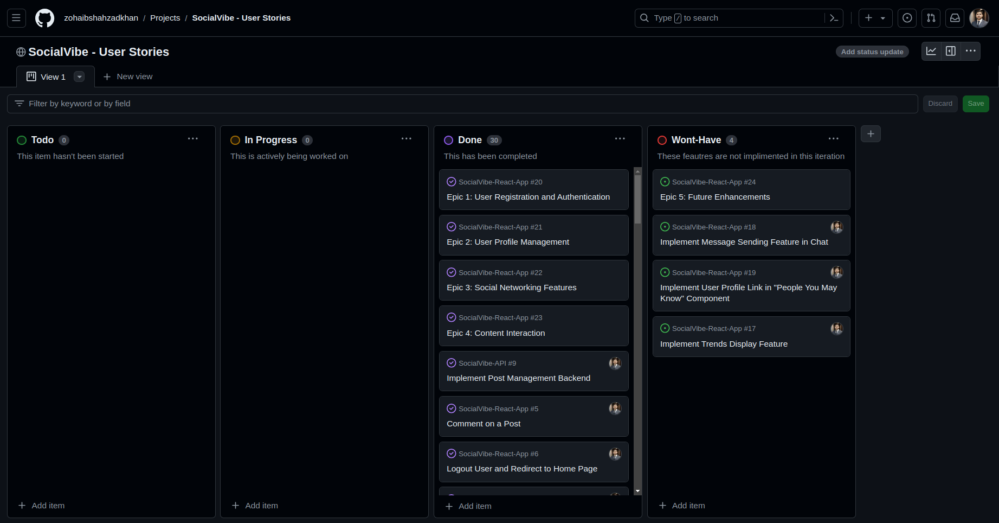
</details>

### MoSCoW Prioritization

MoSCoW prioritization technique is employed to prioritize project requirements based on their importance and urgency. This ensures that essential features are addressed first, followed by those of lower priority.

<details>
  <summary>MoSCoW Prioritization Example</summary>
  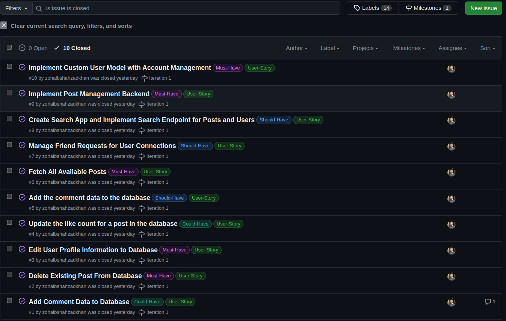
</details>

### Milestones

Milestones are set to mark significant stages or deadlines within the project timeline. Each milestone is linked with relevant issues and tasks to ensure alignment with project goals and deadlines.

<details>
  <summary>Example Milestones</summary>
  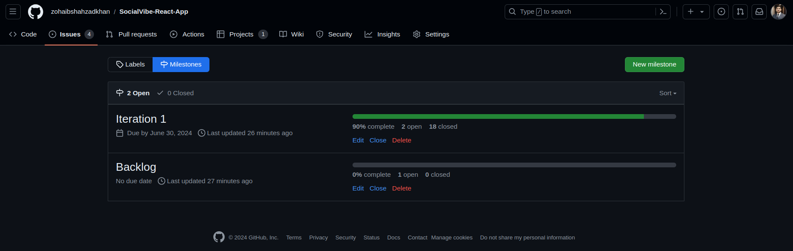
</details>

## Database Design

## ERD

<details>
  <summary>Entity Relationship Diagram</summary>
  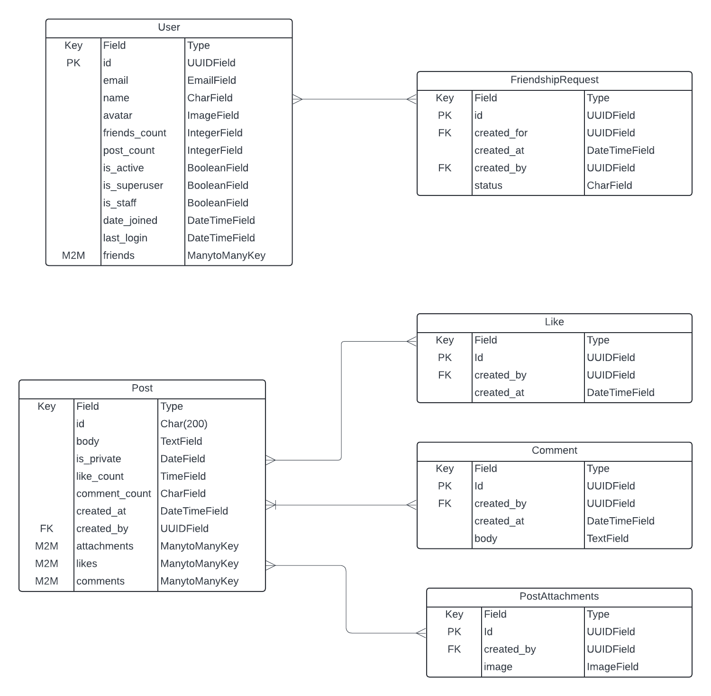
</details>

## Database Model and Data Models

### (ERD) Physical Database Model

This sample ERD diagram was made using Lucid Charts. It visually represents the structure of a PostgreSQL database used in the project, including tables, columns, relationships, and constraints.

## Data Models

### User Model

| Field         | Database Key | Field Type     | Validation                                          |
|---------------|--------------|----------------|-----------------------------------------------------|
| id            | id           | UUIDField      | Primary Key                                         |
| email         | email        | EmailField     | Unique                                              |
| name          | name         | CharField      | max_length=255, blank=True                           |
| avatar        | avatar       | ImageField     | upload_to='avatars', blank=True, null=True           |
| friends_count | friends_count| IntegerField   | default=0                                           |
| posts_count   | posts_count  | IntegerField   | default=0                                           |
| friends       | friends      | ManyToManyField| 'self'                                              |
| is_active     | is_active    | BooleanField   | default=True                                        |
| is_superuser  | is_superuser | BooleanField   | default=False                                       |
| is_staff      | is_staff     | BooleanField   | default=False                                       |
| date_joined   | date_joined  | DateTimeField  | default=timezone.now                                |
| last_login    | last_login   | DateTimeField  | blank=True, null=True                               |

### Post Model

| Field         | Database Key | Field Type        | Validation                                          |
|---------------|--------------|-------------------|-----------------------------------------------------|
| id            | id           | UUIDField         | Primary Key                                         |
| body          | body         | TextField         | blank=True, null=True                               |
| attachments   | attachments  | ManyToManyField   | PostAttachment, blank=True                           |
| is_private    | is_private   | BooleanField      | default=False                                       |
| likes_count   | likes_count  | IntegerField      | default=0                                           |
| comments_count| comments_count| IntegerField      | default=0                                           |
| likes         | likes        | ManyToManyField   | Like, blank=True                                    |
| comments      | comments     | ManyToManyField   | Comment, blank=True                                 |
| created_at    | created_at   | DateTimeField     | auto_now_add=True                                   |
| created_by    | created_by   | ForeignKey        | User, related_name='posts', on_delete=models.CASCADE|

### PostAttachment Model

| Field         | Database Key | Field Type     | Validation                                          |
|---------------|--------------|----------------|-----------------------------------------------------|
| id            | id           | UUIDField      | Primary Key                                         |
| image         | image        | ImageField     | upload_to='post_attachments'                        |
| created_by    | created_by   | ForeignKey     | User, related_name='post_attachments', on_delete=models.CASCADE|

### Like Model

| Field         | Database Key | Field Type     | Validation                                          |
|---------------|--------------|----------------|-----------------------------------------------------|
| id            | id           | UUIDField      | Primary Key                                         |
| created_by    | created_by   | ForeignKey     | User, related_name='likes', on_delete=models.CASCADE|
| created_at    | created_at   | DateTimeField  | auto_now_add=True                                   |

### Comment Model

| Field         | Database Key | Field Type     | Validation                                          |
|---------------|--------------|----------------|-----------------------------------------------------|
| id            | id           | UUIDField      | Primary Key                                         |
| body          | body         | TextField      | blank=True, null=True                               |
| created_by    | created_by   | ForeignKey     | User, related_name='comments', on_delete=models.CASCADE|
| created_at    | created_at   | DateTimeField  | auto_now_add=True                                   |

### FriendshipRequest Model

| Field         | Database Key | Field Type     | Validation                                          |
|---------------|--------------|----------------|-----------------------------------------------------|
| id            | id           | UUIDField      | Primary Key                                         |
| created_for   | created_for  | ForeignKey     | User, related_name='received_friendshiprequests', on_delete=models.CASCADE|
| created_at    | created_at   | DateTimeField  | auto_now_add=True                                   |
| created_by    | created_by   | ForeignKey     | User, related_name='created_friendshiprequests', on_delete=models.CASCADE|
| status        | status       | CharField      | choices=[('sent', 'Sent'), ('accepted', 'Accepted'), ('rejected', 'Rejected')]|

### CustomUserManager

The CustomUserManager extends UserManager and provides custom methods for creating users and superusers, including email normalization and password setting.

- `_create_user`: Creates a user with normalized email and hashed password.
- `create_user`: Creates a regular user with default permissions.
- `create_superuser`: Creates a superuser with admin permissions.

### Methods and Functions

- `created_at_formatted`: A method in models like Comment and Post to format `created_at` field to human-readable time since creation.

### Default Image URLs

- **User Avatar:**
  - If `avatar` field is not set, a default image URL is used.
  - Example: [Avatar](https://res.cloudinary.com/dceudxuqq/image/upload/v1718720898/media/profile_gs8tic.png)

## Features

### Authentication
All endpoints require authentication via JWT token for access. Users must obtain a token by logging in or signing up.

### Endpoints

| Endpoint                               | Method | Description                                              | Requires Token |
|-----------------------------------------|--------|----------------------------------------------------------|----------------|
| `/api/me/`                              | GET    | Retrieve authenticated user's profile information.       | Yes            |
| `/api/signup/`                          | POST   | Register a new user.                                      | No             |
| `/api/login/`                           | POST   | Obtain JWT token for authentication.                     | No             |
| `/api/refresh/`                         | POST   | Refresh JWT token.                                       | Yes            |
| `/api/editprofile/`                     | POST   | Update user profile information.                         | Yes            |
| `/api/friends/<uuid:pk>/`               | GET    | Retrieve user's friends list and friendship requests.    | Yes            |
| `/api/friends/<uuid:pk>/request/`       | POST   | Send a friendship request to another user.               | Yes            |
| `/api/friends/<uuid:pk>/<str:status>/`  | POST   | Accept or reject a friendship request.                   | Yes            |
| `/api/posts/`                           | GET    | Retrieve all posts.                                      | Yes            |
| `/api/posts/create/`                    | POST   | Create a new post.                                       | Yes            |
| `/api/posts/<uuid:pk>/`                 | GET    | Retrieve a specific post.                                | Yes            |
| `/api/posts/<uuid:pk>/delete/`          | DELETE | Delete a specific post.                                  | Yes            |
| `/api/posts/<uuid:pk>/like/`            | POST   | Like a specific post.                                    | Yes            |
| `/api/posts/<uuid:pk>/comment/`         | POST   | Comment on a specific post.                              | Yes            |
| `/api/search/?query=<query>`            | POST   | Search for posts and users based on a query.             | Yes            |

### Usage

1. **Authentication:** Obtain a JWT token using `/api/login/` or `/api/signup/` endpoints.
2. **Accessing Endpoints:** Include the obtained token in the Authorization header (`Authorization: Bearer <token>`) for accessing protected endpoints.

### Examples

#### 1. Retrieve Authenticated User's Profile Information

```http
GET /api/me/
Authorization: Bearer <token>

Response:

json

{
  "id": "5b9128ac-4fe5-4e7f-85e3-3a6a7e8ac5ea",
  "name": "John Doe",
  "email": "john.doe@example.com",
  "avatar": "https://example.com/media/avatars/avatar.jpg"
}
```
#### 2. Register a New User

```
POST /api/signup/
{
  "email": "newuser@example.com",
  "name": "New User",
  "password1": "password123",
  "password2": "password123"
}

Response:

json
{
  "message": "success"
}
```

#### 3. Obtain JWT Token (Login)

```
POST /api/login/
{
  "email": "john.doe@example.com",
  "password": "password123"
}

Response:
{
  "access": "<access_token>",
  "refresh": "<refresh_token>"
}

```

#### 4. Refresh JWT Token

```
POST /api/refresh/
{
  "refresh": "<refresh_token>"
}

Response: 
{
  "access": "<new_access_token>"
}

```

#### 5. Update User Profile Information

```
POST /api/editprofile/
Authorization: Bearer <token>
{ "name": "John Doe"
  "email": "new.email@example.com"
  "avatar": "avatar.jpg"
}

Response:

{
  "message": "information updated",
  "user": {
    "id": "5b9128ac-4fe5-4e7f-85e3-3a6a7e8ac5ea",
    "name": "John Doe",
    "email": "new.email@example.com",
    "avatar": "https://example.com/media/avatars/avatar.jpg"
  }
}


```

#### 6. Retrieve User's Friends List and Friendship Requests

```
GET /api/friends/5b9128ac-4fe5-4e7f-85e3-3a6a7e8ac5ea/
Authorization: Bearer <token>

Response:

{
  "user": {
    "id": "5b9128ac-4fe5-4e7f-85e3-3a6a7e8ac5ea",
    "name": "John Doe",
    "email": "john.doe@example.com",
    "avatar": "https://example.com/media/avatars/avatar.jpg"
  },
  "friends": [
    {
      "id": "7b5b392c-01f6-48f8-9d2c-79d5552a8db5",
      "name": "Jane Smith",
      "email": "jane.smith@example.com",
      "avatar": "https://example.com/media/avatars/jane.jpg"
    }
  ],
  "requests": [
    {
      "id": "1d3a24d4-7c82-42e0-931f-5e31a6245eb5",
      "created_for": "5b9128ac-4fe5-4e7f-85e3-3a6a7e8ac5ea",
      "created_by": "a25796c2-6016-4fb7-b536-684a1fdd17ec",
      "status": "sent",
      "created_at": "2023-06-01T12:00:00Z"
    }
  ],
  "can_send_request": true
}

```

#### 7. Create a New Post

```
POST /api/posts/create/
Authorization: Bearer <token>
{
  "body": "This is a new post.",
  "attachments": [1, 2]
}

Response:

{
  "id": "3cc843f3-9d7d-4d58-8e2d-7f06ef3b122c",
  "body": "This is a new post.",
  "attachments": [
    {
      "id": "1",
      "image": "https://example.com/media/post_attachments/image1.jpg"
    },
    {
      "id": "2",
      "image": "https://example.com/media/post_attachments/image2.jpg"
    }
  ],
  "is_private": false,
  "likes_count": 0,
  "comments_count": 0,
  "created_at": "2023-06-01T12:00:00Z",
  "created_by": {
    "id": "5b9128ac-4fe5-4e7f-85e3-3a6a7e8ac5ea",
    "name": "John Doe",
    "avatar": "https://example.com/media/avatars/avatar.jpg"
  }
}


```

#### 8. Retrieve a Specific Post

```
GET /api/posts/3cc843f3-9d7d-4d58-8e2d-7f06ef3b122c/
Authorization: Bearer <token>

Response:

{
  "post": {
    "id": "3cc843f3-9d7d-4d58-8e2d-7f06ef3b122c",
    "body": "This is a new post.",
    "attachments": [
      {
        "id": "1",
        "image": "https://example.com/media/post_attachments/image1.jpg"
      },
      {
        "id": "2",
        "image": "https://example.com/media/post_attachments/image2.jpg"
      }
    ],
    "is_private": false,
    "likes_count": 0,
    "comments_count": 0,
    "created_at": "2023-06-01T12:00:00Z",
    "created_by": {
      "id": "5b9128ac-4fe5-4e7f-85e3-3a6a7e8ac5ea",
      "name": "John Doe",
      "avatar": "https://example.com/media/avatars/avatar.jpg"
    }
  }
}

```

#### 9. Delete a Specific Post

```
DELETE /api/posts/3cc843f3-9d7d-4d58-8e2d-7f06ef3b122c/delete/
Authorization: Bearer <token>

Response:

{
  "message": "post deleted"
}

```

#### 10. Like a Specific Post

```
POST /api/posts/3cc843f3-9d7d-4d58-8e2d-7f06ef3b122c/like/
Authorization: Bearer <token>

Response:

{
  "message": "like created"
}

```

#### 11. Comment on a Specific Post

```
POST /api/posts/3cc843f3-9d7d-4d58-8e2d-7f06ef3b122c/comment/
Authorization: Bearer <token>
{
  "body": "This is a comment."
}
Response:
{
  "id": "1a2b3c4d-5e6f-7g8h-9i0j-1k2l3m4n5o6p",
  "body": "This is a comment.",
  "created_by": {
    "id": "5b9128ac-4fe5-4e7f-85e3-3a6a7e8ac5ea",
    "name": "John Doe",
    "avatar": "https://example.com/media/avatars/avatar.jpg"
  },
  "created_at": "2023-06-01T12:00:00Z"
}

```
### Usage
- Authentication: Obtain a JWT token using /api/login/ or /api/signup/ endpoints.
- Accessing Endpoints: Include the obtained token in the Authorization header (Authorization: Bearer <token>) for accessing protected endpoints.


## Testing 

A separate testing document has been created as [Testing.md](Testing.md)

## Validation

### Python
- **CI Python Linter**: Python files were validated using CI Python Linter.
  - **Files Checked**: All custom Python files excluding `settings.py` and `env.py`.
  
  
Validation was performed on the following components:

#### Account App
  <details>
  <summary>views.py</summary>
  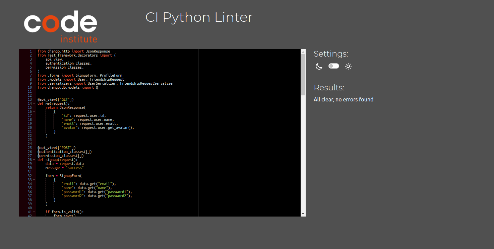
  </details>

  <details>
  <summary>form.py</summary>
  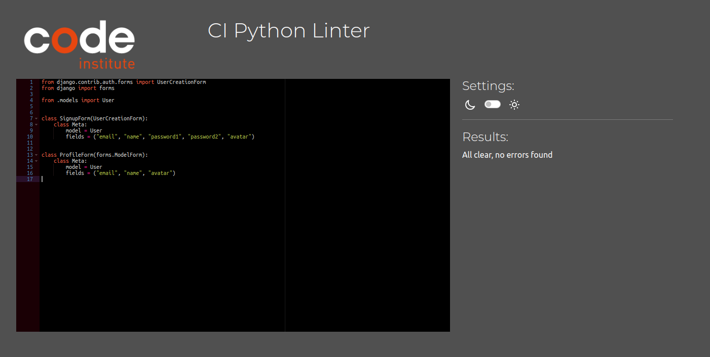
  </details>

  <details>
  <summary>models.py</summary>
  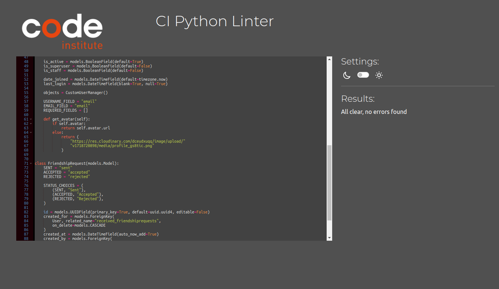
  </details>


  <details>
  <summary>serializer.py</summary>
  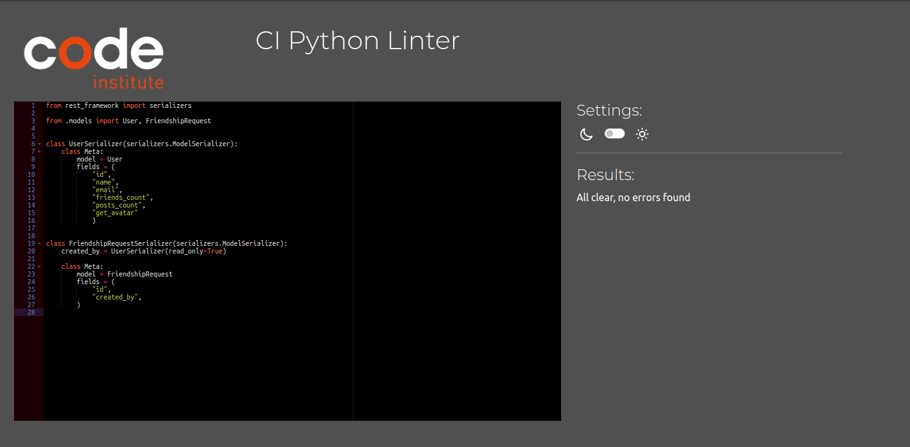
  </details>


  <details>
  <summary>urls.py</summary>
  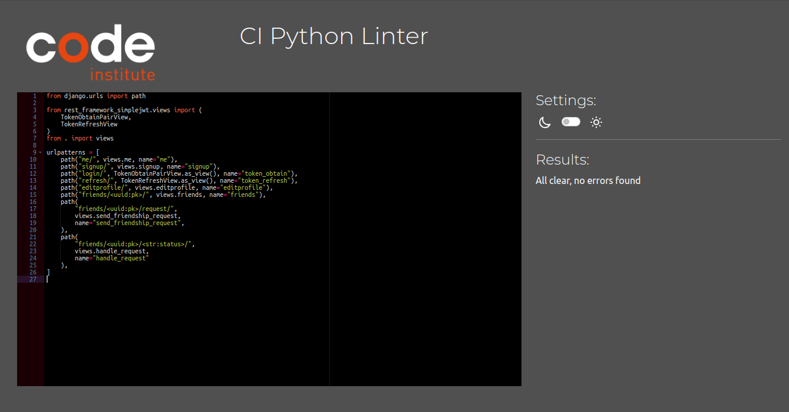
  </details>


  <details>
  <summary>tests.py</summary>
  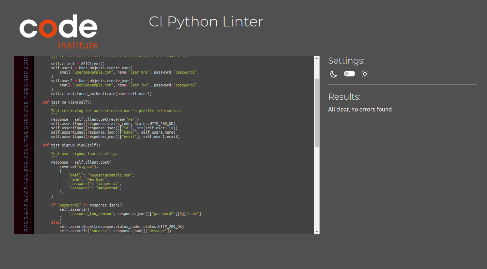
  </details>

#### Post App
  <details>
  <summary>views.py</summary>
  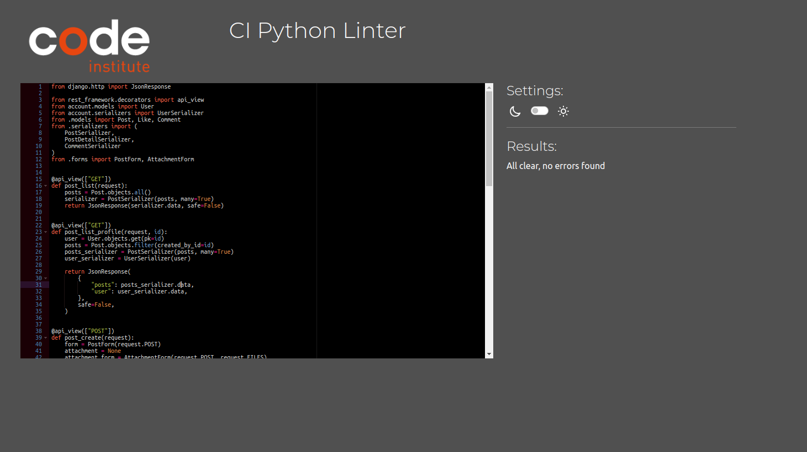
  </details>

  <details>
  <summary>form.py</summary>
  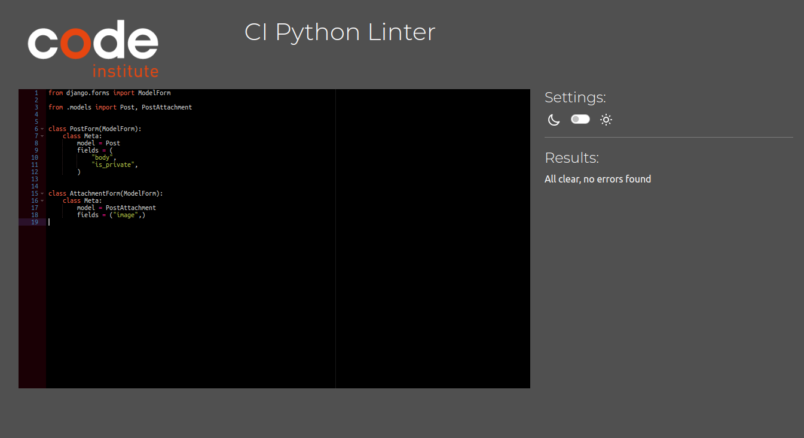
  </details>

  <details>
  <summary>models.py</summary>
  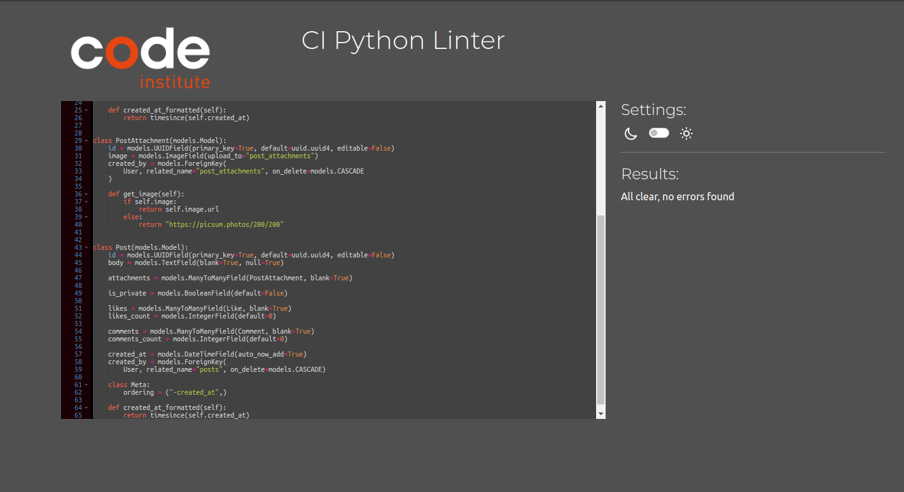
  </details>


  <details>
  <summary>serializer.py</summary>
  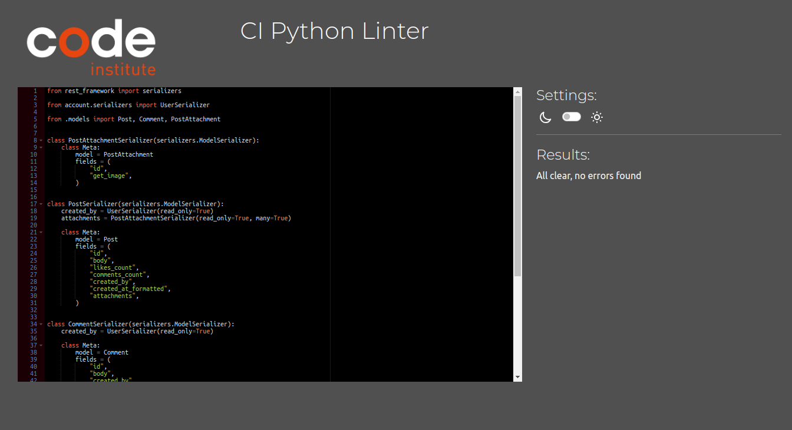
  </details>


  <details>
  <summary>urls.py</summary>
  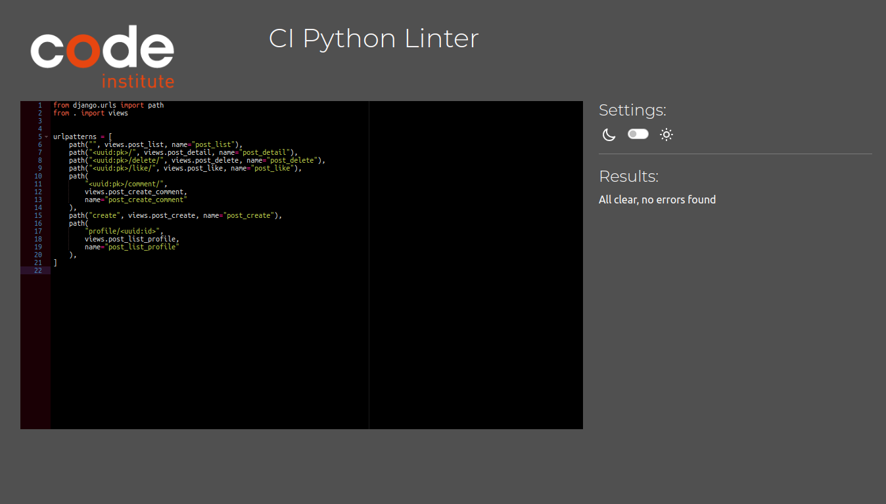
  </details>


  <details>
  <summary>tests.py</summary>
  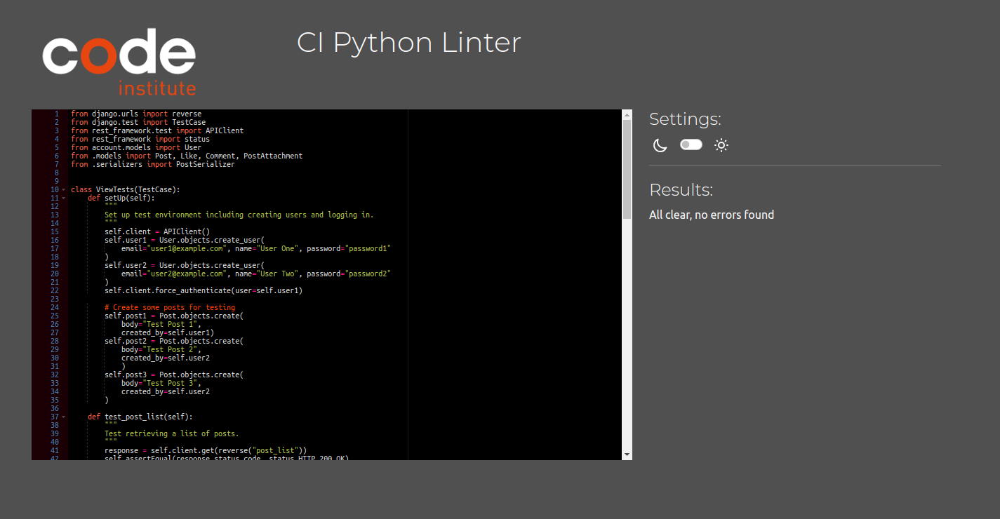
  </details>

#### Backend App
 <details>
  <summary>views.py</summary>
  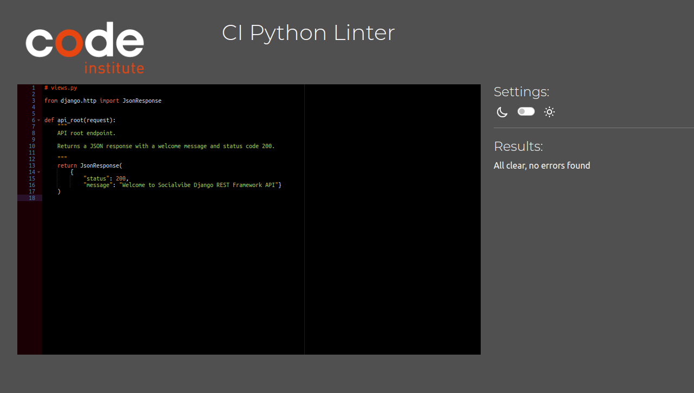
  </details>

  <details>
  <summary>urls.py</summary>
  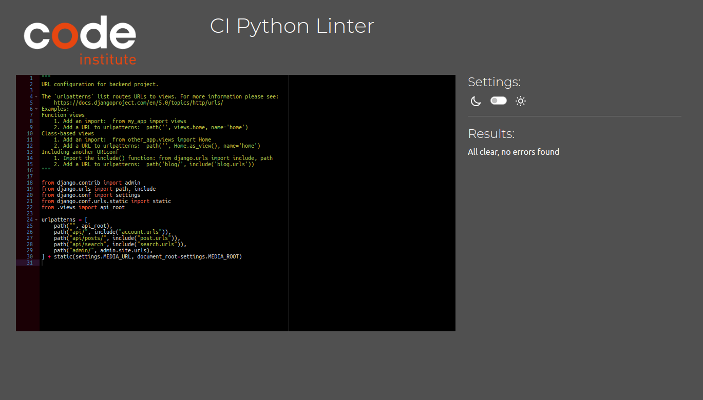
  </details>


#### Search App
 <details>
  <summary>views.py</summary>
  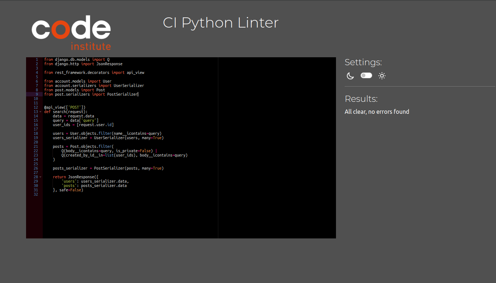
  </details>


  <details>
  <summary>urls.py</summary>
  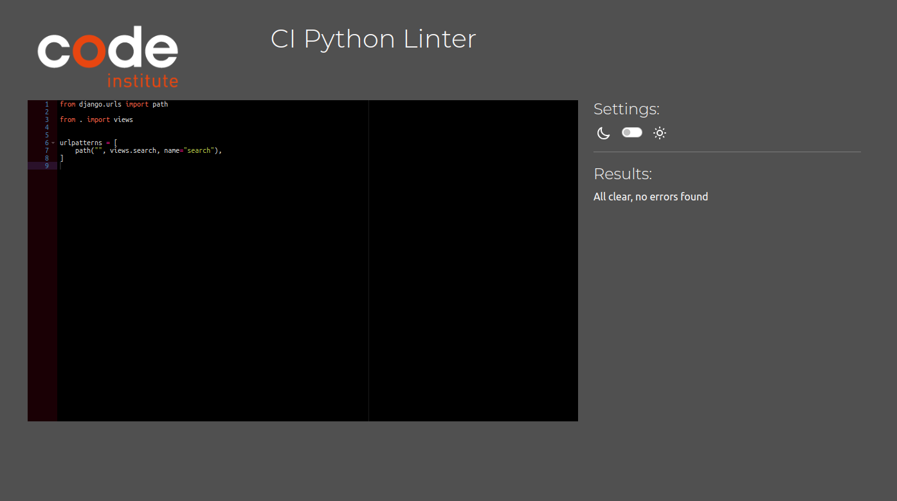
  </details>


  <details>
  <summary>tests.py</summary>
  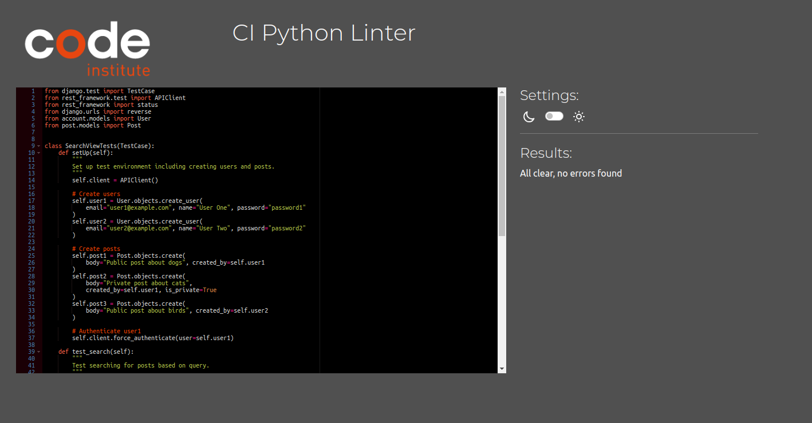
  </details>

## Deployment
### Cloning & Forking
#### Fork
1. On GitHub.com, navigate to the [zohaibshahzadkhan/SocialVibe-API](https://github.com/zohaibshahzadkhan/SocialVibe-API) repository.
2. In the top-right corner of the page, click Fork.
3. By default, forks are named the same as their parent repositories. You can change the name of the fork to distinguish it further.
4. Add a description to your fork.
5. Click Create fork.

#### Clone
1. Above the list of files click the button that says 'Code'.
2. Copy the URL for the repository.
3. Open Terminal. Change the directory to the location where you want the cloned directory.
4. Type git clone, and then paste the URL
5. Press Enter.

### Local Deployment
1. On GitHub.com, navigate to the [zohaibshahzadkhan/SocialVibe-API](https://github.com/zohaibshahzadkhan/SocialVibe-API) repository and clone it.
2. Once you clone the repository you will need to install the libraries, you can do this by typing "pip3 install -r requirements.txt" into the terminal from root directory of the project.
3. Rename sample_env.py to .env file and change the key pair values to match your credentials. There is a [sample env file](./sample_env.py) that you can use. 
4. Run `python3 manage.py runserver` from the root directory to run server locally

### Remote Deployment 
1. Log in to Heroku
2. Click 'Create new app'.
3. Give your application a unique name, select a region appropriate to your location and click the 'Create app' button.
4. You can use an external database for example postgre or use 'Heroku Postgres' under the Add-ons section.
5. Go to settings section and click 'Reveal Config Vars' in the Config vars section.
6. Add CLOUDINARY_URL and the value as your cloudinary API key.
7.  Add SECRET_KEY and the value as a complex string which will be used to provide cryptographic signing.
8.  Add DATABASE_URL if you are using a different database than Heroku Postgres.
9.  Add ALLOWED_HOST it will be deployed URL of the Api.
10. Add CLIENT_ORIGIN it will be the frontend application interacting with the API. 
11. Navigate to the 'Deploy' page
12. Select 'GitHub' from the 'Deployment method' section
13. Enter your github account details and select the forked/ clone repository.
14. Select 'Manual deploy', select the 'main' branch in the drop down and click the 'Deploy' button.
15. Once built, click the 'View' button to load the URL.

### Database
A Postgres database instance has been used for this project, provided by CodeInstitute.

If you wish to use ElephantSQL follow these steps

1. Open your web browser and go to the [ElephantSQL](https://www.elephantsql.com/) website.
2. Sign up for a free account or log in if you already have an account.
3. Once you have logged in, you will be taken to the Dashboard. From here, click on the "Create New Instance" button.
4. You will now be taken to a page where you can configure your new database instance. Choose the "Tiny Turtle" plan which is free.
5. Select the region where you want to host your database. The closest region to you is usually the best choice.
6. Choose a name for your instance, this will be the name of your database.
7. Choose a username and password for your instance.
8. Click on the "Create" button to create your new database instance.
9. The database url was stored in a config var: 'DATABASE_URL' on Heroku. This variable was then used in the settings.py to connect to the database.
10. Click on the "Details" tab to view your instance details.
11. Look for the "URI" field, which contains the connection details you need to connect to your database. The URI should start with: 'postgres://'

The models were migrated to the database by entering the following commands in the terminal:

```
python3 manage.py makemigrations

python3 manage.py migrate

```
 The live link can be found here - [SocialVibe-API](https://socialvibe-api-32609e33d535.herokuapp.com/)

### Prerequisite
- A Cloudinary account will be needed, create one for free at https://cloudinary.com.


***

## Credits

- There has been useful guidance from various articles from Stack Overflow - [Stack Overflow ](https://stackoverflow.com/)

- Django Documentation - [Django](https://docs.djangoproject.com/en/5.0/)

- Lucid Chart - This helped me to design my flow charts and class diagrams - [Lucid Chart](https://lucid.app/)

- Figma - This helped me to design my wire-frames - [Figma](https://www.figma.com/)

## Acknowledgements
I want to express my immense gratitude to Code Institute for their Django course. Throughout this program, I've gained valuable knowledge that has been instrumental in developing this application.
