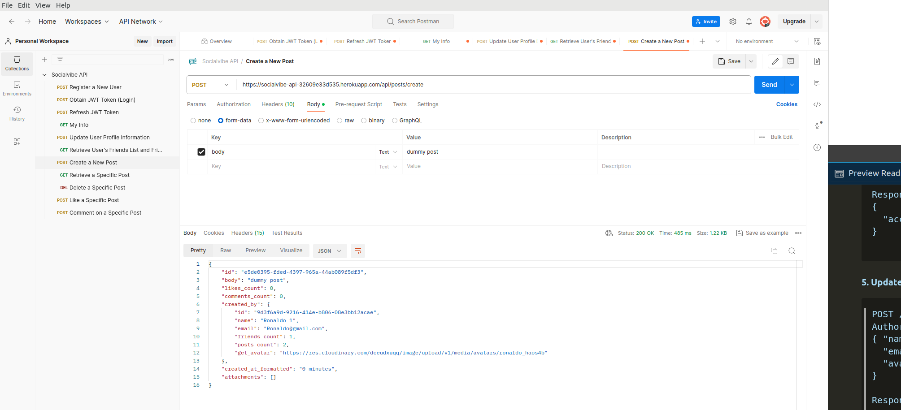

## Manual Testing of User Stories

| User Story | Description |
|------------|-------------|
| [User Story 1](#user-story-1-implement-custom-user-model-and-account-management) | Implement Custom User Model and Account Management |
| [User Story 2](#user-story-2-manage-posts-and-attachments) | Manage Posts and Attachments |
| [User Story 3](#user-story-3-implement-search-endpoint) | Implement Search Endpoint |
| [User Story 4](#user-story-4-manage-friend-requests) | Manage Friend Requests |
| [User Story 5](#user-story-5-fetch-all-available-posts) | Fetch All Available Posts |
| [User Story 6](#user-story-6-handle-comment-data) | Handle Comment Data |
| [User Story 7](#user-story-7-update-like-count-for-posts) | Update Like Count for Posts |
| [User Story 8](#user-story-8-update-user-profile-information) | Update User Profile Information |
| [User Story 9](#user-story-9-delete-posts) | Delete Posts |

---

### User Story 1: Implement Custom User Model and Account Management

#### Steps

1. **Sign Up**
   - Open Postman and make a POST request to `/signup` with valid user data.
   - Include `email`, `name`, `password1`, and `password2` fields in the request body.

2. **Log In**
   - Make a POST request to `/login` with the registered user's credentials.
   - Ensure the response includes an access token for authentication.

3. **Retrieve User Profile**
   - Make a GET request to `/me` to retrieve the authenticated user's profile information.

#### Expected Results

- After signing up and logging in, the responses should return appropriate status codes (200 OK) and tokens for authentication.
- The `/me` endpoint should return the user's ID, name, email, and possibly an avatar.

#### Actual Results

  
Screenshots

  
  
  

---

### User Story 2: Manage Posts and Attachments

#### Steps

1. **Create a Post**
   - Send a POST request to `/posts` with post data including text content and optional attachments (images, videos).

2. **Retrieve Posts**
   - Make a GET request to `/posts` to fetch all available posts.
   - Check that the response contains a list of posts with their content and attachments.

3. **Delete a Post**
   - Send a DELETE request to `/posts/{post_id}` with the ID of a post to delete it.

#### Expected Results

- Posts should be successfully created, retrieved, and deleted as expected.
- Attachments (if any) should be visible or downloadable from the retrieved posts.

#### Actual Results

  
Screenshots

  
  
  

---

### User Story 3: Implement Search Endpoint

#### Steps

1. **Search for Posts**
   - Send a GET request to `/search?q={query}` with a search query.
   - Verify that the response includes relevant posts matching the query.

2. **Search for Users**
   - Similarly, send a GET request to `/search?q={query}` to search for users.
   - Check that the response includes relevant user profiles based on the query.

#### Expected Results

- The search endpoint should return posts and users matching the provided search query.
- Responses should include relevant data fields (e.g., post content, user profiles).

#### Actual Results

  
Screenshots

  

---

### User Story 4: Manage Friend Requests

#### Steps

1. **Send Friend Request**
   - Make a POST request to `api/friend/{user_id}/request/` to send a friend request to another user.

2. **Handle Friend Request**
   - Send a POST request to `/api/friends/{request_id}/{status}/` to accept or reject a friend request.

3. **Retrieve Friends List**
   - GET request to `/friends` to retrieve the list of friends and pending requests.

#### Expected Results

- Friend requests should be successfully sent and handled (accepted/rejected) as intended.
- The friends endpoint should display the user's friends and pending requests.

#### Actual Results

  
Screenshots

  
  
  

---

### User Story 5: Fetch All Available Posts

#### Steps

1. **Fetch All Posts**
   - Make a GET request to `/posts` without authentication to fetch all available posts.

#### Expected Results

- The endpoint should return a list of posts from all users in the system.
- Posts should include content, attachments, and metadata (like timestamps).

#### Actual Results

  
Screenshots

  

---

### User Story 6: Handle Comment Data

#### Steps

1. **Add Comment**
   - Send a POST request to `/posts/{post_id}/comments` with comment data in the request body.

2. **Retrieve Comments**
   - Make a GET request to `/posts/{post_id}/comments` to retrieve comments for a specific post.

#### Expected Results

- Comments should be successfully added to posts and retrieved as expected.
- Each comment should include content, author information, and timestamps.

#### Actual Results

  
Screenshots

  

---

### User Story 7: Update Like Count for Posts

#### Steps

1. **Like a Post**
   - Send a POST request to `/posts/{post_id}/like` or `/posts/{post_id}/unlike` to like  a post.

#### Expected Results

- The like count for the specified post should update accordingly after each like operation.
- Responses should confirm the success of the like operation.

#### Actual Results

  
Screenshots

  

---

### User Story 8: Update User Profile Information

#### Steps

1. **Edit Profile**
   - Send a POST request to `/editprofile` with updated user information (email, name, profile image).

#### Expected Results

- User profile information should update successfully in the database.
- The response should confirm the successful update of profile information.

#### Actual Results

  
Screenshots

  

---

### User Story 9: Delete Posts

#### Steps

1. **Delete a Post**
   - Send a DELETE request to `/posts/{post_id}` to delete a specific post.

#### Expected Results

- The post should be deleted permanently from the database.
- The response should confirm the successful deletion of the post.

#### Actual Results

  
Screenshots

  

## Automated Testing:

## Setting Up Postman with Socialvibe API Collection

### Prerequisites
1. **Install Postman**: Make sure you have Postman installed on your system. If not, download it from [postman.com](https://www.postman.com/downloads/).

### Importing the Collection
1. **Download the Collection File**: Obtain the [Collection File](./Socialvibe-API.postman_collection.json) file.

2. **Open Postman**:
   - Launch Postman on your computer.

3. **Import the Collection**:
   - Click on the **Import** button located in the top left corner of the Postman window.
   - Select the **File** tab in the Import dialog.
   - Click **Upload Files** and navigate to the location where you downloaded `Socialvibe-API.postman_collection.json`.
   - Select the file and click **Open**.
   - The collection will now be imported into your Postman workspace.

### Using the Collection
1. **Explore Endpoints**:
   - Once imported, you will see the collection named `Socialvibe-API` in the left sidebar of Postman.
   - Click on the collection to expand and view the available requests (endpoints).

2. **Execute Requests**:
   - Click on any request within the collection to open it.
   - Adjust parameters as needed (e.g., query parameters, request body).
   - Click **Send** to execute the request and view the response.

3. **View Responses**:
   - Postman will display the response body, headers, and other relevant details in the lower part of the window after sending a request.

### Additional Notes
- **Authentication**: If the API requires authentication, ensure you have the necessary credentials or tokens set up in Postman.

## Bugs:
No bigs were found in API.

